# Implementation

## Document Control
Version: 4.0 (Extended Edition)  
Date: 2026-03-01  
Owner: Thesis Author  
Target Length: Approximately 40 pages in Word (format-dependent)

## Table of Contents
1. Chapter Overview
2. Implementation Environment and Setup
3. System Architecture and Processing Pipeline
4. Data Contracts and Internal Representations
5. Core Module Implementation
6. Visualization, Layout, and Interaction Implementation
7. Metrics and Evaluation Instrumentation
8. Export and Reporting Implementation
9. End-to-End Operational Workflows
10. UI Layer and Control Design
11. Error Handling, Robustness, and Safety
12. Performance and Complexity Analysis
13. Figures and Captions
14. Requirement-to-Code Traceability
15. Implementation Constraints and Extension Roadmap
16. Detailed Component Specifications
17. Detailed Algorithm Narratives
18. Reproducibility Protocol
19. Quality Assurance and Verification Strategy
20. Risk Management and Operational Mitigation
21. Chapter Summary
22. Implementation References

---

## 1. Chapter Overview

This chapter presents the practical implementation of the thesis system: a browser-based RDF visualization platform designed for compact graph rendering, reproducible evaluation, and export-ready artifacts. The chapter is structured to connect requirement-level statements to concrete software modules and runtime behavior.

The implementation has two parallel goals:

1. Academic goal: produce stable, measurable visualization outputs suitable for thesis evaluation.
2. Operational goal: provide usable interactive exploration for day-to-day graph inspection.

To satisfy both goals, the application separates deterministic evaluation behavior from exploratory interaction behavior. In evaluation mode, layout and metric generation are designed for repeatability. In explore mode, the system prioritizes navigation smoothness and inspection usability.

From a software engineering perspective, the implementation is organized into small modules with clear interfaces. Parsing, querying, validation, layout, rendering, metrics, and export are implemented as discrete units and connected in a central orchestrator (`App.jsx`). This modular design improves maintainability and makes requirement traceability explicit.

---

## 2. Implementation Environment and Setup

### 2.1 Technology Stack

The implementation uses the following stack:

1. React 18 for component-based UI and state flow.
2. D3 v7 for SVG drawing, zoom behavior, force simulation, and interaction utilities.
3. ELK.js for automatic graph layout.
4. N3 parser for Turtle/N-Triples/N3 ingestion.
5. Vite for development/build pipeline.
6. Tailwind CSS and custom CSS for UI styling.

Dependencies are declared in [package.json](/Volumes/T7/Thesis/MAIN%20PROJECT/rdf_graph/package.json).

### 2.2 Execution Model

The system runs fully in the browser. No dedicated backend service is required for core features. This architecture provides these benefits:

1. Lower deployment complexity.
2. Local-first processing for uploaded files.
3. Direct export from in-memory graph and metric structures.

The only network-dependent path is SPARQL endpoint querying, which is user-initiated.

### 2.3 Development and Build Commands

The application lifecycle is managed by npm scripts:

1. `npm run dev` for local development.
2. `npm run build` for production bundle creation.
3. `npm run preview` for serving the built output locally.

### 2.4 Source Layout

The implementation follows a layered file structure:

1. `src/components/` for UI panels and graph rendering view.
2. `src/lib/` for data and processing logic.
3. `public/examples/` for sample RDF/SPARQL/config assets.
4. `evaluation/` for thesis documentation and generated figure assets.

This structure keeps domain logic independent from presentation components.

---

## 3. System Architecture and Processing Pipeline

### 3.1 High-Level Architecture

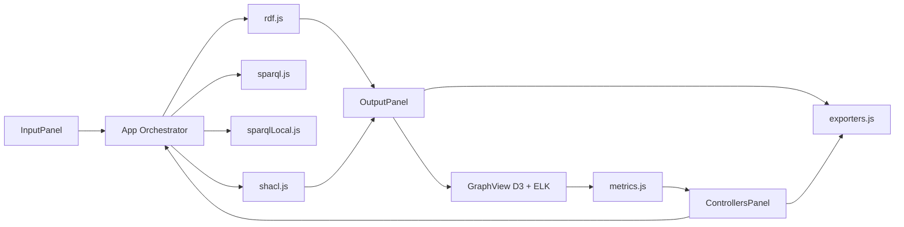

The architecture is event-driven and state-centered. User actions trigger orchestrator methods, which execute parsing/layout workflows and update UI states.

### 3.2 Pipeline Stages

The full runtime pipeline contains the following stages:

1. Input acquisition (file or endpoint).
2. Data normalization to internal triples.
3. Optional SPARQL filtering (remote or local).
4. Graph assembly (nodes/edges and semantic annotations).
5. Optional SHACL validation.
6. Layout generation and SVG rendering.
7. Metric computation on positioned nodes/edges.
8. Graph and metric export.

### 3.3 Central Orchestration in `App.jsx`

`App.jsx` is the runtime coordinator and state owner for:

1. `graph`
2. `config`
3. `status`
4. `renderStats`
5. `metrics`
6. `shaclReport`

It also maintains source caches and SHACL violation mapping to support efficient rebuilds when configuration changes (especially node limit adjustments).

Implementation reference: [App.jsx](/Volumes/T7/Thesis/MAIN%20PROJECT/rdf_graph/src/App.jsx).

---

## 4. Data Contracts and Internal Representations

A key implementation decision is to normalize all ingestion paths into stable internal contracts.

### 4.1 Triple Contract

Every parser and query path converges to a uniform triple object:

```json
{
  "s": "subjectIRIOrBlank",
  "p": "predicateIRI",
  "o": "objectValue",
  "oIsLiteral": true,
  "oLabel": "display-friendly value"
}
```

The inclusion of `oIsLiteral` and `oLabel` avoids repeated term-type inference during graph construction and rendering.

### 4.2 Graph Contract

The rendering pipeline consumes a graph object with this shape:

```json
{
  "title": "Graph Name",
  "nodes": [{ "id": "...", "label": "...", "isLiteral": false }],
  "edges": [{ "source": "...", "target": "...", "predicate": "..." }]
}
```

This contract is intentionally lightweight and compatible with both parsed RDF and pre-built graph JSON input.

### 4.3 Configuration Contract

`defaultConfig` in `rdf.js` defines baseline behavior for:

1. Parsing and simplification (`collapseLiterals`, `mergeParallelEdges`, hidden predicates).
2. Labeling (`nodeLabel`, `edgeLabel`).
3. Layout options (`elk.algorithm`, `elk.direction`, spacing/routing).
4. Mode flags (`evaluationMode`, `exploreMode`).
5. Node limits and filters.

Because this config is exported with metrics, it also serves as a reproducibility record.

### 4.4 Metrics Contract

`computeGraphMetrics` returns a structured object containing geometry, compactness, quality guardrails, and notes for skipped expensive computations.

This unified metric contract supports both on-screen display and JSON/CSV export.

---

## 5. Core Module Implementation

## 5.1 Data Ingestion and Parsing (`rdf.js`)

`parseRDFFileOrJSON` handles extension-based parsing logic and returns either triples or graph objects depending on options.

Supported formats and handlers:

1. `.ttl`, `.nt`, `.n3` -> N3 parser.
2. `.rdf`, `.xml` -> RDF/XML DOM traversal.
3. `.jsonld` and JSON-LD structured `.json` -> JSON-LD conversion.
4. Graph JSON `.json` with `{nodes, edges}` -> passthrough.

This module is responsible for strict input validation and explicit error messages on unsupported structure.

Implementation reference: [rdf.js](/Volumes/T7/Thesis/MAIN%20PROJECT/rdf_graph/src/lib/rdf.js).

## 5.2 Graph Construction from Triples (`rdf.js`)

`triplesToGraph` transforms triples into renderable graph elements and applies simplification policies.

Major steps:

1. Create subject/object nodes.
2. Optionally collapse literal objects into subject multiline labels.
3. Filter hidden predicates.
4. Build edges with templated predicate labels.
5. Optionally merge parallel edges.
6. Apply node limit and edge pruning.
7. Resolve final node labels and type-based grouping.

This conversion stage is central to compactness control and readability.

## 5.3 SPARQL Endpoint Integration (`sparql.js`)

`fetchTriplesFromEndpoint` implements robust endpoint access:

1. Attempt POST with SPARQL query MIME type.
2. Fallback to GET for endpoint compatibility.
3. Parse SPARQL JSON result bindings.
4. Convert bindings to internal triple contract.

The fallback strategy is important because SPARQL endpoint implementations vary in accepted request methods.

Implementation reference: [sparql.js](/Volumes/T7/Thesis/MAIN%20PROJECT/rdf_graph/src/lib/sparql.js).

## 5.4 Local SPARQL-Like Filtering (`sparqlLocal.js`)

The local query engine supports a controlled subset of SPARQL for filtering already-loaded triples.

Implemented capability:

1. Prefix parsing.
2. SELECT-WHERE extraction.
3. Triple-pattern tokenization.
4. Recursive pattern matching with variable bindings.
5. LIMIT support.

Explicitly unsupported constructs:

1. `OPTIONAL`
2. `FILTER`
3. `UNION`
4. `GRAPH`
5. `MINUS`
6. `BIND`
7. `VALUES`

Unsupported queries are rejected with clear errors and handled gracefully by the orchestrator.

Implementation reference: [sparqlLocal.js](/Volumes/T7/Thesis/MAIN%20PROJECT/rdf_graph/src/lib/sparqlLocal.js).

## 5.5 SHACL Validation (`shacl.js`)

The SHACL implementation targets practical data-quality checks needed for thesis evaluation.

Supported constraints:

1. `sh:targetClass`
2. `sh:path`
3. `sh:minCount`
4. `sh:maxCount`
5. `sh:class`
6. `sh:message`

Validation output includes:

1. Global `conforms` status.
2. Total violation count.
3. Per-node violation mapping.
4. Flat message list.

Node-level violations are attached to rendered nodes and consumed by styling and tooltips.

Implementation reference: [shacl.js](/Volumes/T7/Thesis/MAIN%20PROJECT/rdf_graph/src/lib/shacl.js).

---

## 6. Visualization, Layout, and Interaction Implementation

## 6.1 Layout Synthesis with ELK (`GraphView.jsx`)

`buildElkGraph` maps nodes and edges to ELK input format and composes layout options from config.

Important mode-dependent behavior:

1. Evaluation mode: compact spacing and orthogonal routing defaults.
2. Explore mode: smoother routing options and optional force dynamics.

This mode split enforces reproducibility where needed and flexibility elsewhere.

## 6.2 Node Size Strategy

Node dimensions are determined by one of two strategies:

1. Uniform sizing (fixed baseline dimensions).
2. Measured sizing based on multiline label length.

Uniform sizing is useful for controlled evaluation runs. Measured sizing improves readability for descriptive labels.

## 6.3 SVG Rendering Pipeline with D3

Rendering steps in `GraphView`:

1. Create SVG and zoom layer.
2. Build edge paths and optional edge labels.
3. Render node shapes based on semantic kind (class/entity/literal/blank).
4. Render multiline text labels.
5. Attach click/touch interactions for tooltip inspection.

Semantic color and shape mappings are consistent and designed for quick visual differentiation.

## 6.4 Viewport and Zoom Constraints

Zoom behavior includes:

1. Scale limits.
2. Translation extents.
3. Clamp function that prevents content from drifting out of viewport.
4. Fit-to-content utility that computes best scale for current bounds.

These constraints reduce disorientation during graph navigation.

## 6.5 Explore Mode Force Simulation

When explore mode is enabled and evaluation mode is disabled, D3 force simulation is applied with:

1. Link force.
2. Charge force.
3. Collision force.
4. Weak origin anchors toward ELK coordinates.
5. Drag behavior.

This gives users smooth local adjustment while preserving global structure.

## 6.6 Node Inspection Tooltips

Tooltips provide contextual node details:

1. Node ID and label.
2. Semantic kind.
3. Degree summary.
4. Top predicates.
5. SHACL violation messages.

Tooltip content is HTML-escaped before insertion, reducing injection risk from label content.

Implementation reference: [GraphView.jsx](/Volumes/T7/Thesis/MAIN%20PROJECT/rdf_graph/src/components/GraphView.jsx).

---

## 7. Metrics and Evaluation Instrumentation

## 7.1 Implemented Metrics (`metrics.js`)

The metric module computes compactness and readability-related values:

1. Bounding box area.
2. Density.
3. Average and median edge length.
4. Edge crossing count.
5. Node overlap count.
6. Aspect ratio.
7. Whitespace ratio.
8. Edge length spread statistics.

## 7.2 Runtime Safeguards

Two expensive metrics are guarded by thresholds:

1. Edge crossing computation is skipped for high edge counts.
2. Node overlap computation is skipped for high node counts.

When skipped, explicit note fields are included so exported metrics remain interpretable.

## 7.3 Timing Instrumentation

The orchestrator and renderer collect stage timings:

1. Parse time.
2. Filter time.
3. Graph build time.
4. ELK layout time.
5. Total render time.

This timing data is merged into metric exports for evaluation reproducibility.

## 7.4 Metric Export in JSON and CSV

`ControllersPanel` supports downloading metrics in:

1. JSON (full structure).
2. CSV (flattened structure).

CSV flattening supports spreadsheet analysis and direct insertion into evaluation tables.

Implementation references:
- [metrics.js](/Volumes/T7/Thesis/MAIN%20PROJECT/rdf_graph/src/lib/metrics.js)
- [ControllersPanel.jsx](/Volumes/T7/Thesis/MAIN%20PROJECT/rdf_graph/src/components/ControllersPanel.jsx)

---

## 8. Export and Reporting Implementation

## 8.1 Graph Export Formats

`exportSvgElement` supports:

1. SVG via XML serialization.
2. PNG via canvas rasterization.
3. JPG via canvas rasterization with white background.
4. PDF via minimal embedded JPEG-in-PDF writer.

## 8.2 SVG Serialization Reliability

Before serialization, the exporter ensures required namespaces (`xmlns`, `xmlns:xlink`) exist in the cloned SVG root.

## 8.3 PDF Generation Strategy

The PDF generator constructs a minimal valid document:

1. Catalog and page tree objects.
2. Image XObject stream.
3. Content stream for placement.
4. Cross-reference table and trailer.

This dependency-light approach is sufficient for thesis figure export.

## 8.4 Metrics File Export

Text-based exports use Blob downloads through `exportTextFile`, which is shared by JSON and CSV metric paths.

Implementation reference: [exporters.js](/Volumes/T7/Thesis/MAIN%20PROJECT/rdf_graph/src/lib/exporters.js).

---

## 9. End-to-End Operational Workflows

### 9.1 Local RDF File Workflow

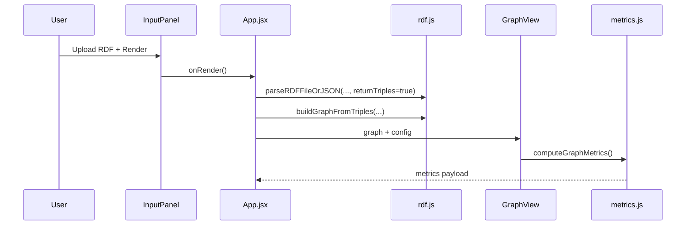

### 9.2 SPARQL Endpoint Workflow

1. User enters endpoint URL and query.
2. Endpoint returns bindings.
3. Bindings are normalized to triples.
4. Graph build and rendering continue as in file workflow.

### 9.3 SHACL Validation Workflow

1. Shapes file is uploaded.
2. Data triples and shape triples are parsed.
3. Validator executes target class and property constraints.
4. Violations are attached to nodes and surfaced visually.

### 9.4 Evaluation Export Workflow

1. User enables evaluation mode.
2. System renders deterministic layout.
3. User exports graph image.
4. User exports metrics with metadata and timings.

This workflow produces reproducible artifacts for thesis result chapters.

---

## 10. UI Layer and Control Design

### 10.1 Input Panel

`InputPanel.jsx` includes:

1. RDF/JSON file selector.
2. SPARQL query editor.
3. Optional endpoint URL.
4. Optional SHACL shapes upload.
5. Render button and graph export controls.
6. Runtime status display.

### 10.2 Output Panel

`OutputPanel.jsx` includes:

1. Graph canvas container.
2. Node/edge count badges.
3. Fit and reset controls.
4. SHACL conformance summary block.

### 10.3 Controllers Panel

`ControllersPanel.jsx` includes:

1. Layout direction and algorithm selectors.
2. Explore and evaluation mode toggles.
3. Simplification toggles.
4. Node limit slider.
5. Label template inputs.
6. Metrics viewer and JSON/CSV metric download.

### 10.4 Advanced Config Editor

`ConfigCheatsheet.jsx` supports direct structured config editing, including filters and live JSON preview. This is useful for reproducible experiment setup.

---

## 11. Error Handling, Robustness, and Safety

### 11.1 Error Handling Strategy

Errors are handled at multiple layers:

1. Parser-level input validation errors.
2. Query-level transport and syntax errors.
3. SHACL validation exceptions.
4. Export precondition checks.

The orchestrator wraps major stages with guarded handling and status feedback.

### 11.2 Recovery Behavior

When recoverable errors occur, the app favors continuity:

1. Local SPARQL parse failure does not crash rendering flow.
2. SHACL failure does not block graph rendering.
3. Missing SVG during export yields informative status.

### 11.3 Privacy and Data Handling

1. Uploaded local files are processed locally in browser memory.
2. No automatic upload path exists.
3. Network requests are limited to user-provided endpoint URLs.

### 11.4 Safety-Oriented Design Notes

1. Tooltip content is escaped.
2. Unsupported operations fail explicitly, not silently.
3. Metrics include notes when calculations are skipped.

---

## 12. Performance and Complexity Analysis

### 12.1 Complexity Summary by Module

1. Triple normalization and graph assembly: near-linear in triple count.
2. Local SPARQL matching: backtracking behavior depending on pattern complexity.
3. SHACL subset validation: linear indexing plus targeted constraint checks.
4. Metrics core: linear for simple metrics; quadratic worst-case for crossings/overlaps.
5. Rendering: proportional to node/edge counts plus ELK layout cost.

### 12.2 Implemented Performance Controls

1. Node limit slider with immediate effect.
2. Literal collapsing and parallel edge merge options.
3. Threshold-based skipping for expensive metric calculations.
4. Evaluation mode without physics simulation.

### 12.3 Build Output Observation

`npm run build` completed successfully. Bundle-size warnings indicate opportunities for future code splitting but do not block functional operation.

---

## 13. Figures and Captions

All figure assets are stored in [evaluation/figures](/Volumes/T7/Thesis/MAIN%20PROJECT/rdf_graph/evaluation/figures).

### 13.1 Figure Index

| Figure | Caption | Source |
| --- | --- | --- |
| Figure 13.1 | App orchestration pipeline screenshot | `src/App.jsx:88-250` |
| Figure 13.2 | Triple-to-graph conversion screenshot | `src/lib/rdf.js:192-270` |
| Figure 13.3 | Local SPARQL parser screenshot | `src/lib/sparqlLocal.js:38-90` |
| Figure 13.4 | SHACL validation core screenshot | `src/lib/shacl.js:104-184` |
| Figure 13.5 | ELK layout options screenshot | `src/components/GraphView.jsx:89-125` |
| Figure 13.6 | Zoom constraint logic screenshot | `src/components/GraphView.jsx:562-624` |
| Figure 13.7 | Force simulation screenshot | `src/components/GraphView.jsx:848-924` |
| Figure 13.8 | Metrics and export core screenshots | `src/lib/metrics.js`, `src/lib/exporters.js` |

### 13.2 Embedded Figures

**Figure 13.1. App orchestration implementation screenshot.**

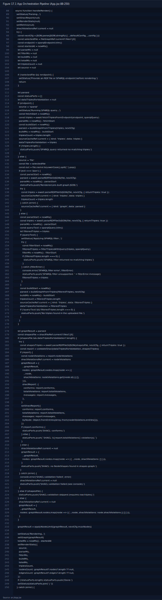

**Figure 13.2. Triple-to-graph conversion implementation screenshot.**

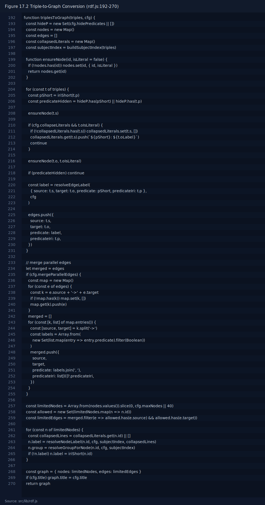

**Figure 13.3. Local SPARQL parser implementation screenshot.**

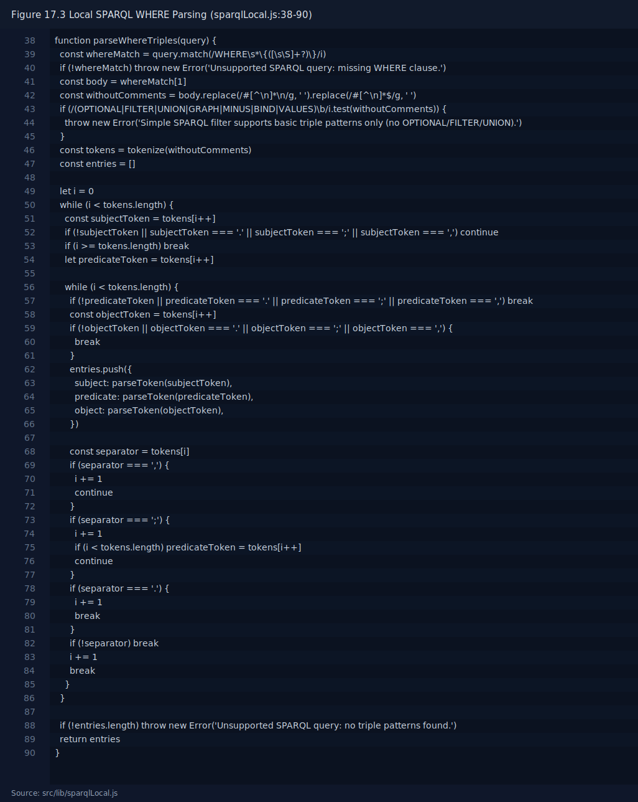

**Figure 13.4. SHACL validation implementation screenshot.**

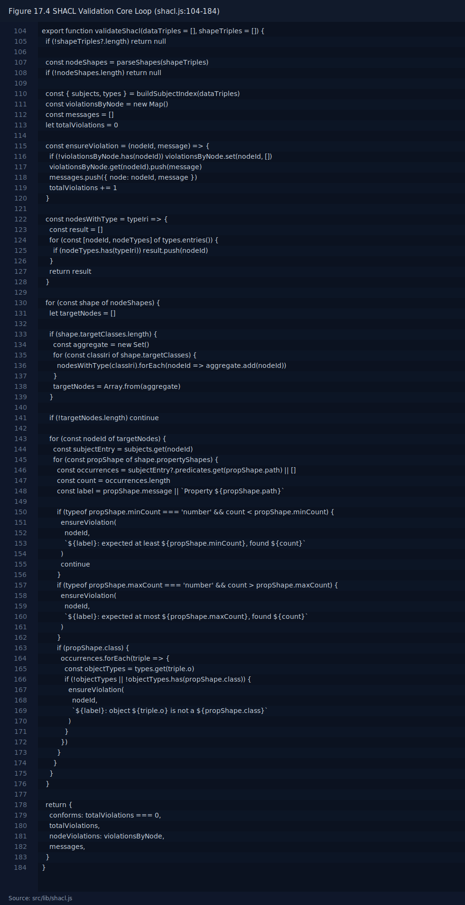

**Figure 13.5. ELK layout option builder implementation screenshot.**

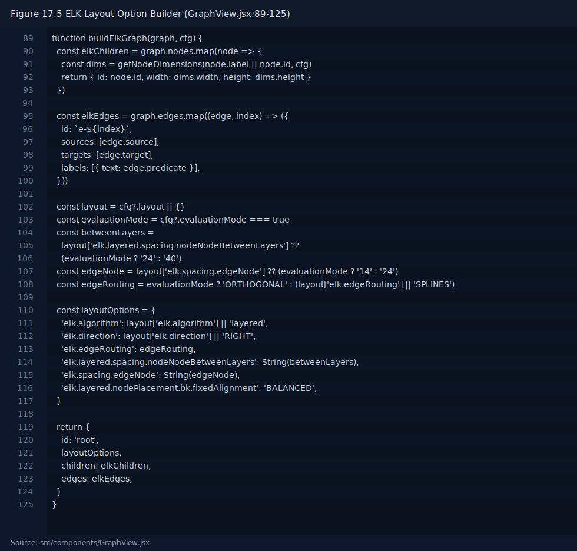

**Figure 13.6. Zoom and viewport constraint implementation screenshot.**

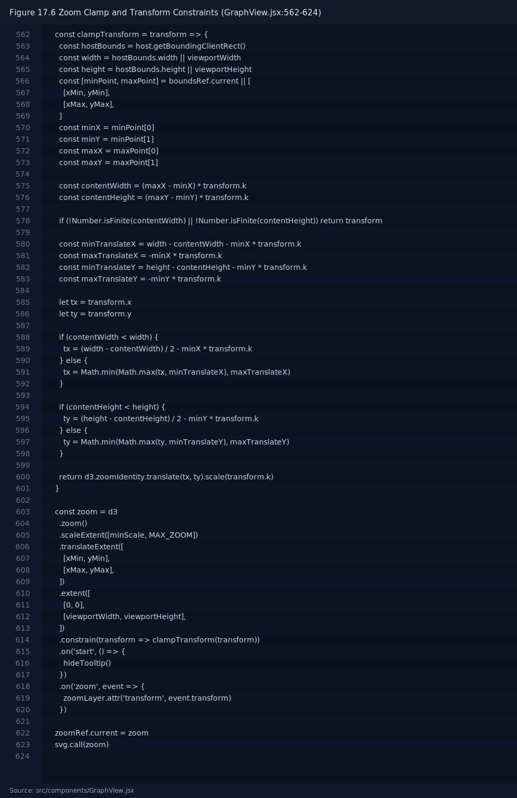

**Figure 13.7. Explore mode force simulation implementation screenshot.**

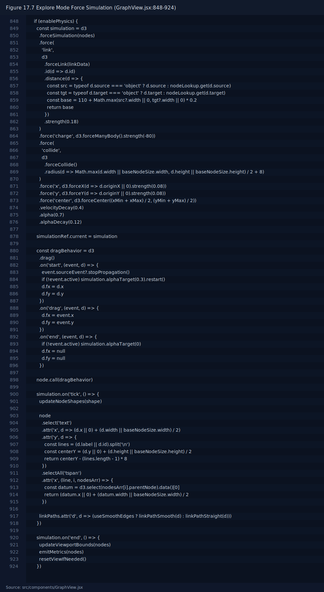

**Figure 13.8. Metrics and export implementation screenshots.**

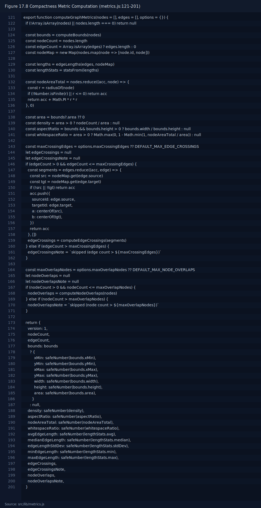

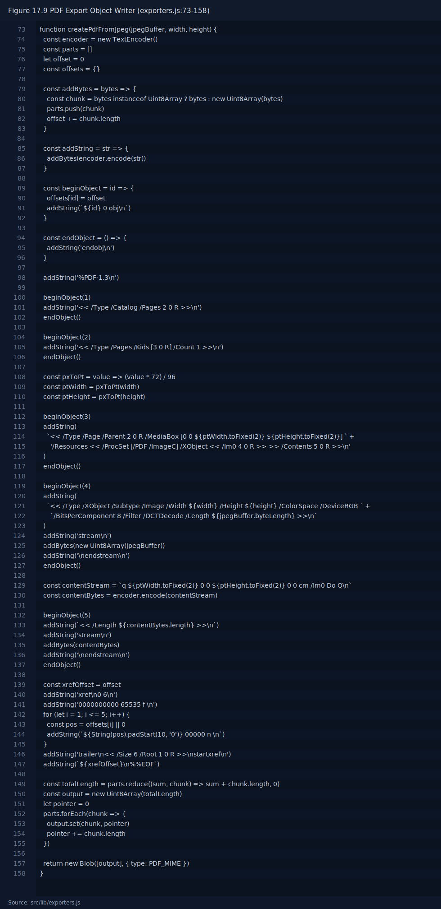

---

## 14. Requirement-to-Code Traceability

| Requirement Area | Implemented In |
| --- | --- |
| Multi-format RDF ingestion | `src/lib/rdf.js` |
| SPARQL endpoint querying | `src/lib/sparql.js` |
| Local SPARQL filtering | `src/lib/sparqlLocal.js` |
| Graph assembly and semantics | `src/lib/rdf.js`, `src/components/GraphView.jsx` |
| Deterministic and explore modes | `src/components/GraphView.jsx`, `src/components/ControllersPanel.jsx` |
| SHACL validation and annotation | `src/lib/shacl.js`, `src/components/GraphView.jsx` |
| Compactness metric computation | `src/lib/metrics.js` |
| Metrics visualization and export | `src/components/ControllersPanel.jsx` |
| Graph export (SVG/PNG/JPG/PDF) | `src/lib/exporters.js`, `src/components/InputPanel.jsx` |
| Node limit and large-graph handling | `src/App.jsx`, `src/lib/rdf.js`, `src/components/ControllersPanel.jsx` |

---

## 15. Implementation Constraints and Extension Roadmap

### 15.1 Current Constraints

1. Local SPARQL support is intentionally restricted.
2. SHACL coverage is subset-based, not full-spec.
3. Bundle size can be improved.
4. Automated test suite remains future work.

### 15.2 Recommended Extensions

1. Add automated tests for parser, SHACL, and metrics correctness.
2. Add code splitting for heavy visualization dependencies.
3. Expand SHACL support if dataset requirements demand it.
4. Add standardized benchmark runner for repeated thesis experiments.
5. Improve local SPARQL support or integrate a complete browser SPARQL engine.

---

## 16. Detailed Component Specifications

This section expands the implementation description from a module list into explicit component contracts. The objective is to make each unit’s responsibility, inputs, outputs, and side effects clear for readers and reviewers.

### 16.1 `App.jsx` Contract as Integration Kernel

`App.jsx` is the execution kernel of the application. It is responsible for cross-module composition and state coherence.

Responsibilities:

1. Receive user commands from input and controller components.
2. Resolve source strategy (file-driven or endpoint-driven).
3. Execute the parse/filter/build/validate sequence.
4. Preserve consistency between graph state, metrics state, and status messages.
5. Coordinate graph export and metric export interactions.

Core orchestrator state:

| State | Description | Updated By | Consumed By |
| --- | --- | --- | --- |
| `graph` | Current render model | `handleRender`, node-limit rebuild | `OutputPanel`, `GraphView` |
| `config` | Runtime configuration | Controllers/Config editor | All processing stages |
| `status` | User-facing runtime messages | Orchestrator stage transitions | `InputPanel` |
| `renderStats` | Timings and counts | `handleRender` | Metrics export UI |
| `metrics` | Computed compactness data | `GraphView` callback | Metrics panel/export |
| `shaclReport` | Validation summary | SHACL stage | `OutputPanel` |

Design note:

1. The orchestrator intentionally keeps domain modules stateless where possible.
2. Runtime decision logic remains centralized so that evaluation mode behavior can be audited.

### 16.2 `InputPanel` Component Contract

`InputPanel.jsx` is designed as a pure interaction surface with callback-based communication. It does not perform parsing or querying itself.

Input functions exposed:

1. RDF file selector.
2. SHACL file selector.
3. SPARQL query text editor.
4. Optional SPARQL endpoint URL field.
5. Render trigger.
6. Export trigger and export format selection.

The panel always mirrors current status text from orchestrator state, making pipeline progress transparent.

### 16.3 `OutputPanel` Component Contract

`OutputPanel.jsx` binds render state to visible canvas behavior:

1. Hosts the rendering container.
2. Displays dynamic node/edge counts.
3. Exposes fit/reset view controls by calling imperative methods on `GraphView`.
4. Shows SHACL conformance summary when available.

This component intentionally avoids data processing logic to keep rendering and orchestration concerns separate.

### 16.4 `ControllersPanel` Contract

`ControllersPanel.jsx` is the primary configuration and evaluation panel. It provides controlled mutators for runtime parameters:

1. Layout direction and algorithm.
2. Explore mode and evaluation mode toggles.
3. Simplification switches (edge merge, literal collapse, SHACL highlighting, uniform sizing).
4. Node limit slider.
5. Node/edge label templates.
6. Metrics view and metrics export.

Because these controls alter both rendering and evaluation output, each control is treated as part of the experiment configuration surface.

### 16.5 `GraphView` Contract

`GraphView.jsx` has a dual contract:

1. Visualization contract: convert graph model to interactive SVG.
2. Evaluation contract: emit deterministic metrics payload to parent callback.

Imperative methods exposed through `forwardRef`:

1. `fitToContent()`
2. `resetZoom()`

This explicit interface allows UI controls to remain decoupled from rendering internals.

### 16.6 `src/lib` Modules as Processing Units

`src/lib` modules are intentionally narrow:

1. `rdf.js`: parsing + graph assembly.
2. `sparql.js`: remote endpoint transport and binding normalization.
3. `sparqlLocal.js`: local query filtering.
4. `shacl.js`: SHACL subset validation.
5. `metrics.js`: geometry and compactness metrics.
6. `exporters.js`: graph/metrics export utilities.

This modularization supports unit-level verification and clearer debugging boundaries.

---

## 17. Detailed Algorithm Narratives

This section summarizes key algorithms in implementation form and connects them to runtime behavior.

### 17.1 Render Pipeline Algorithm

The orchestrator flow in `handleRender` can be represented as:

```text
if no input and no endpoint:
    report status and return

load config snapshot
if endpoint provided:
    fetch endpoint triples
else:
    parse local file into triples or graph
    if local query exists:
        attempt local SPARQL filtering

if SHACL shapes provided and triples available:
    parse shapes
    validate shapes against data
    attach violations to nodes

apply node limit
update graph state
update runtime stats
publish status
```

Algorithmic properties:

1. The pipeline is stage-oriented and failure-contained.
2. Stage timings are captured at coarse granularity.
3. Node limit enforcement appears late to ensure metric/report consistency with displayed graph.

### 17.2 Triple-to-Graph Assembly Algorithm

`triplesToGraph` performs transformation with optional simplification:

```text
initialize node map, edge list, collapsed literal map
for each triple:
    ensure subject node exists
    if collapse literals and object is literal:
        append literal line to subject buffer
        continue
    ensure object node exists
    skip hidden predicates
    append edge

if merge parallel edges:
    bucket by source-target
    merge label sets

apply node limit and edge pruning
resolve node labels and groups
return graph
```

Key design effect:

1. The same triple set can produce different visual complexity profiles depending on config flags.
2. Label-template and literal-collapse choices directly influence compactness metrics.

### 17.3 Local SPARQL Filtering Algorithm

The local filter uses recursive pattern matching with variable bindings:

```text
parse prefixes
extract SELECT variables
extract WHERE triple patterns
for pattern index i:
    iterate over all triples
    test term matches with current bindings
    if match:
        recurse to i+1 with updated bindings
on completion:
    materialize resulting triples from bindings
    deduplicate by subject|predicate|object|literalFlag key
```

Rationale:

1. This strategy is simple, transparent, and sufficient for thesis-scale local filtering.
2. Unsupported advanced SPARQL syntax is explicitly rejected to avoid ambiguous behavior.

### 17.4 SHACL Validation Algorithm

Validation is implemented in three phases:

1. Parse shape graph into NodeShape definitions.
2. Index data graph by subjects and RDF types.
3. For each shape and target node, evaluate property constraints.

Constraint checks:

1. `minCount`
2. `maxCount`
3. `class`

Violation outputs are accumulated in a node-indexed map and flattened message list.

### 17.5 Layout + Explore Hybrid Algorithm

Rendering in `GraphView` follows:

```text
build ELK graph options from config
run ELK layout
map ELK result to render nodes/edges
draw SVG layers
if explore mode enabled:
    start D3 force simulation seeded by ELK positions
else:
    keep static ELK geometry
compute metrics on final node positions
```

This hybrid approach is central to balancing repeatability and usability.

### 17.6 Metric Computation Algorithm

`computeGraphMetrics` performs:

1. Bounds calculation from positioned nodes.
2. Edge length distribution from source/target centers.
3. Derived compactness values (density, whitespace, aspect ratio).
4. Optional crossing and overlap detection with threshold guards.

For large graphs, crossing/overlap analysis can be skipped with explanatory notes to preserve responsiveness.

---

## 18. Reproducibility Protocol

This section defines an operational protocol for generating thesis-quality reproducible artifacts from the implemented system.

### 18.1 Pre-Run Checklist

Before running evaluation experiments:

1. Fix dataset and source path/URL.
2. Freeze SPARQL query text.
3. Freeze configuration object.
4. Ensure evaluation mode is enabled.
5. Use consistent browser and viewport class.

### 18.2 Canonical Evaluation Run Steps

1. Load dataset via file input or endpoint query.
2. Apply the intended filter/query.
3. Confirm node limit and simplification settings.
4. Execute render.
5. Open metrics panel and verify metric availability.
6. Export graph artifact (`SVG` or `PDF` recommended).
7. Export metrics artifact (`JSON` and `CSV`).
8. Record run metadata (dataset, config ID, timestamp, environment notes).

### 18.3 Suggested Artifact Naming Scheme

Use deterministic artifact names to support traceability:

`<dataset>__<config>__run-<id>__<yyyy-mm-dd>_<hhmm>.<ext>`

Examples:

1. `foaf__cfg-eval-a__run-01__2026-03-01_1115.svg`
2. `foaf__cfg-eval-a__run-01__2026-03-01_1115.json`
3. `foaf__cfg-eval-a__run-01__2026-03-01_1115.csv`

### 18.4 Repeatability Check Procedure

To validate deterministic behavior:

1. Execute identical run at least three times.
2. Compare structural metric values (area, density, edge lengths, crossings).
3. Confirm no unexpected drift across repeated runs.
4. Treat timing variance as system-level noise, not geometric nondeterminism.

### 18.5 Configuration Comparison Protocol

When comparing two parameter sets:

1. Change only one control group at a time.
2. Keep dataset and query fixed.
3. Export both graph and metrics for each configuration.
4. Report both quantitative deltas and qualitative visual evidence.

### 18.6 Integration with Existing Evaluation Files

The implementation outputs map directly to existing evaluation artifacts in this repository:

1. `evaluation/METRICS_DEFINITION.md`
2. `evaluation/PROTOCOL.md`
3. `evaluation/RESULTS_TEMPLATE.csv`
4. `evaluation/EVALUATION_DRAFT.md`

This allows direct transfer of generated metrics into thesis analysis tables and plots.

---

## 19. Quality Assurance and Verification Strategy

This section describes how the implementation should be verified at module and integration levels.

### 19.1 Verification Scope

Verification focuses on:

1. Data correctness (triples and graph conversion).
2. Rendering correctness (layout, labels, interaction bounds).
3. Validation correctness (SHACL violations).
4. Metric correctness (compactness values and export shape).
5. Export correctness (image and metric files).

### 19.2 Suggested Unit-Level Tests

Recommended unit tests:

1. `rdf.js` parsing tests for each supported format.
2. Label template resolution tests.
3. Parallel edge merge behavior tests.
4. Local SPARQL parser tests for accepted and rejected syntax.
5. SHACL constraint tests for min/max count and class checks.
6. Metric function tests on small deterministic synthetic graphs.

### 19.3 Suggested Integration Tests

Recommended integration scenarios:

1. File ingestion -> graph render -> metric export.
2. Endpoint ingestion -> graph render -> metric export.
3. File ingestion + local SPARQL filter + SHACL shapes.
4. Evaluation mode run repeated twice with same settings.

Each integration test should assert:

1. Non-empty graph under valid inputs.
2. Correct status messages for expected warnings.
3. Export artifacts generated with valid MIME/extension behavior.

### 19.4 Manual Verification Checklist

For thesis delivery, include this manual checklist:

1. Node and edge counters match expectation.
2. Fit/reset controls restore expected viewport behavior.
3. Tooltip shows node degree and predicate summaries.
4. SHACL violations produce visible styling changes.
5. Metrics panel values update after rerender.
6. CSV and JSON metrics files contain matching values.

### 19.5 Regression Safety Strategy

To prevent regression while extending features:

1. Store baseline metrics for selected benchmark datasets.
2. Compare metrics before/after code changes.
3. Track any change in deterministic evaluation outputs.
4. Document intentional output changes with config/version notes.

### 19.6 Verification Gaps in Current Repository State

Current known gaps:

1. Automated test harness is not yet committed.
2. Performance benchmark automation is not yet integrated.
3. Cross-browser visual-diff checks are not yet implemented.

These are non-blocking for prototype demonstration but should be addressed for production-grade release.

---

## 20. Risk Management and Operational Mitigation

### 20.1 Runtime Risk Matrix

| Risk | Likely Trigger | Current Mitigation | Recommended Enhancement |
| --- | --- | --- | --- |
| Large graph rendering slowdown | High node/edge count | Node limit slider, simplification options | Add progressive rendering or clustering |
| Local query mismatch | Unsupported SPARQL syntax | Explicit parser error and fallback behavior | Add advanced parser support or guided query templates |
| Shape validation overload | Large shapes graph | Subset validator and controlled checks | Add staged/async validation mode |
| Metrics computation spikes | Dense graph crossings/overlaps | Threshold-based skip notes | Add approximate crossing algorithms |
| Export inconsistency | External viewer differences | Namespace-safe SVG export, PDF writer | Add export validation snapshots |

### 20.2 Data Integrity Risks

Potential risks:

1. Misinterpretation of JSON input shape (graph JSON vs JSON-LD).
2. Loss of semantic detail through aggressive simplification.
3. Over-reliance on local SPARQL subset for advanced queries.

Current mitigations:

1. Explicit parsing guards with actionable error messages.
2. Config-driven simplification toggles.
3. Endpoint SPARQL path for full query capability.

### 20.3 Reproducibility Risks

Potential reproducibility threats:

1. Mixing explore mode outputs with evaluation results.
2. Untracked configuration changes between runs.
3. Inconsistent environment factors during repeated experiments.

Mitigations:

1. Dedicated evaluation mode.
2. Metrics metadata export includes core config and timing context.
3. Recommended run protocol with artifact naming conventions.

### 20.4 Security and Privacy Risk Notes

1. Local files remain browser-local by default.
2. Endpoint requests are user-controlled.
3. Tooltip content is escaped.
4. No dynamic code execution path is used in parser modules.

Further recommendations:

1. Add request timeout and retry policies for endpoint robustness.
2. Add explicit CORS/network diagnostics UI.
3. Add optional safe-mode that disables endpoint access for fully offline workflows.

---

## 21. Chapter Summary

The implementation delivers a complete RDF visualization and evaluation pipeline with reproducible metrics, configurable rendering, and export-ready outputs. The architecture is modular and aligns with thesis requirements across ingestion, query, validation, layout, interaction, and reporting.

The software supports both deterministic evaluation workflows and practical exploratory analysis. This dual-mode design is central to the thesis objective of balancing academic reproducibility with real-world usability.

In this extended chapter version, implementation evidence is documented not only at module level but also at contract level, algorithm level, and operational protocol level, providing stronger technical support for thesis defense and reviewer audit.

---

## 22. Implementation References

### 22.1 Core Implementation Files

- [App.jsx](/Volumes/T7/Thesis/MAIN%20PROJECT/rdf_graph/src/App.jsx)
- [InputPanel.jsx](/Volumes/T7/Thesis/MAIN%20PROJECT/rdf_graph/src/components/InputPanel.jsx)
- [OutputPanel.jsx](/Volumes/T7/Thesis/MAIN%20PROJECT/rdf_graph/src/components/OutputPanel.jsx)
- [ControllersPanel.jsx](/Volumes/T7/Thesis/MAIN%20PROJECT/rdf_graph/src/components/ControllersPanel.jsx)
- [GraphView.jsx](/Volumes/T7/Thesis/MAIN%20PROJECT/rdf_graph/src/components/GraphView.jsx)
- [rdf.js](/Volumes/T7/Thesis/MAIN%20PROJECT/rdf_graph/src/lib/rdf.js)
- [sparql.js](/Volumes/T7/Thesis/MAIN%20PROJECT/rdf_graph/src/lib/sparql.js)
- [sparqlLocal.js](/Volumes/T7/Thesis/MAIN%20PROJECT/rdf_graph/src/lib/sparqlLocal.js)
- [shacl.js](/Volumes/T7/Thesis/MAIN%20PROJECT/rdf_graph/src/lib/shacl.js)
- [metrics.js](/Volumes/T7/Thesis/MAIN%20PROJECT/rdf_graph/src/lib/metrics.js)
- [exporters.js](/Volumes/T7/Thesis/MAIN%20PROJECT/rdf_graph/src/lib/exporters.js)
- [package.json](/Volumes/T7/Thesis/MAIN%20PROJECT/rdf_graph/package.json)

### 22.2 Figure Assets

- [fig-14-1-app-orchestration.svg](/Volumes/T7/Thesis/MAIN%20PROJECT/rdf_graph/evaluation/figures/fig-14-1-app-orchestration.svg)
- [fig-14-2-triples-to-graph.svg](/Volumes/T7/Thesis/MAIN%20PROJECT/rdf_graph/evaluation/figures/fig-14-2-triples-to-graph.svg)
- [fig-14-3-local-sparql-where.svg](/Volumes/T7/Thesis/MAIN%20PROJECT/rdf_graph/evaluation/figures/fig-14-3-local-sparql-where.svg)
- [fig-14-4-shacl-validation.svg](/Volumes/T7/Thesis/MAIN%20PROJECT/rdf_graph/evaluation/figures/fig-14-4-shacl-validation.svg)
- [fig-14-5-elk-layout-options.svg](/Volumes/T7/Thesis/MAIN%20PROJECT/rdf_graph/evaluation/figures/fig-14-5-elk-layout-options.svg)
- [fig-14-6-zoom-constraints.svg](/Volumes/T7/Thesis/MAIN%20PROJECT/rdf_graph/evaluation/figures/fig-14-6-zoom-constraints.svg)
- [fig-14-7-force-simulation.svg](/Volumes/T7/Thesis/MAIN%20PROJECT/rdf_graph/evaluation/figures/fig-14-7-force-simulation.svg)
- [fig-14-8-metrics-core.svg](/Volumes/T7/Thesis/MAIN%20PROJECT/rdf_graph/evaluation/figures/fig-14-8-metrics-core.svg)
- [fig-14-9-pdf-export.svg](/Volumes/T7/Thesis/MAIN%20PROJECT/rdf_graph/evaluation/figures/fig-14-9-pdf-export.svg)
- [fig-14-10-metrics-export.svg](/Volumes/T7/Thesis/MAIN%20PROJECT/rdf_graph/evaluation/figures/fig-14-10-metrics-export.svg)
